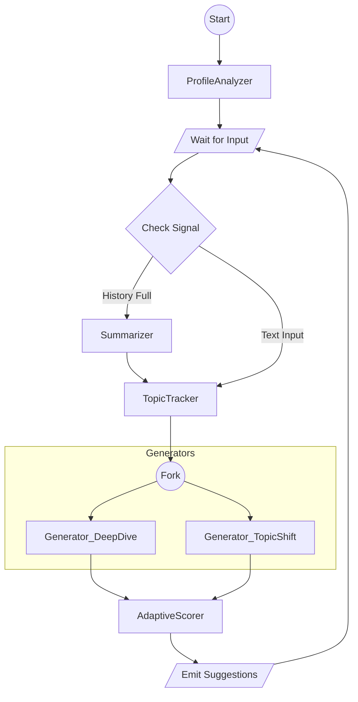

# 会話アシストシステム LangGraph アーキテクチャ設計書

## 1. システム概要
本システムは、2者の会話音声（文字起こし）とSNSデータを入力とし、会話の継続・転換を促す「話題（Topic）」や「質問（Question）」をリアルタイムに提案するバックエンドシステムである。

### 主要なフロー
- 初期化フェーズ: SNSデータを分析し、ユーザプロファイル（興味関心クラスタ）と初期話題プールを生成する。

- ループフェーズ:

  - ルーティング: 入力タイプ（テキスト/沈黙）やコンテキスト量に応じて処理を分岐。

  - 高速パス（沈黙時）: 分析をスキップし、即座に場を繋ぐ話題を提案。

  - 通常パス（会話時）:

    - コンテキスト圧縮（要約）とトピック追跡。

    - [並列処理] 質問生成（深掘り） / 話題提案（転換）。

  - 統合 & フィルタリング: 動的スコアリングにより最適な提案を選出。

## 2. Graph State 設計 (Shared State)

```Python
LangGraph全体で共有・更新されるデータ構造。
from typing import TypedDict, List, Optional, Dict, Literal, Annotated
import operator

# 事前定義カテゴリリスト (共通興味の判定に使用)
CATEGORIES = [
    "スポーツ", "アウトドア", "音楽", "映画", "ゲーム",
    "テクノロジー", "料理", "旅行", "ファッション", "健康",
    "ビジネス", "アート", "読書", "ペット", "その他"
]

class InterestCluster(TypedDict):
    category: str           # 上記CATEGORIESから選択
    vector: List[float]     # そのクラスタの重心ベクトル
    keywords: List[str]

class UserProfile(TypedDict):
    user_id: str
    interest_clusters: List[InterestCluster] # 興味を複数のベクトルクラスタで保持

class Suggestion(TypedDict):
    content: str
    type: Literal["deep_dive", "topic_shift", "silence_break"]
    score: float
    target_user: str 

class ConversationState(TypedDict):
    # --- Input Signal ---
    input_type: Literal["text", "silence"] # 入力シグナル種別
    latest_text: str                       # 最新のバッファ（silence時は空）

    # --- Context Management ---
    history_window: List[Dict]    # 直近Nターン（生データ）
    summary: str                  # 過去の会話の要約（圧縮されたコンテキスト）
    
    # --- Profile Data ---
    profiles: Dict[str, UserProfile] 
    
    # --- Topic Tracking ---
    current_topic_vector: List[float] # 現在の会話内容の埋め込み
    visited_topics: List[str]         # 探索済みのカテゴリ名リスト (例: ["アウトドア", "映画"])
    
    # --- Control Flags ---
    is_terminated: bool            
    
    # --- Output Candidates ---
    candidates: Annotated[List[Suggestion], operator.add]  # 並列ノードの結果をマージするreducer
    final_suggestions: List[Suggestion]
```


## 3. ノード構成 (Nodes)
### Phase 0: Router (条件分岐)
`Edge: RouteInput`

- Logic: 入力シグナルと状態に基づいて次のノードを決定。
  - input_type == "silence" $\to$ SilenceHandler (Fast Path)
  - len(history_window) > Threshold $\to$ Summarizer (Maintenance Path)
  - その他 $\to$ TopicTracker (Normal Path)

### Phase 1: 初期化 (Initialization)
`Node: ProfileAnalyzer`
- In: SNSデータ (JSON)
- Process:
  - ユーザーごとの投稿・いいねデータをクラスタリングし、InterestCluster リスト（Multi-Vector）を生成。
  - 初期の「話題の種」を作成。
- Out: profiles, initial_suggestions

### Phase 2: 高速パス & メンテナンス
`Node: SilenceHandler (Fast Path)`
- Role: 沈黙検知時に、重い分析をスキップして即座に介入する。

- Logic:
  1. 両ユーザーの `interest_clusters` から `category` が一致するものを「共通興味」として抽出。
  2. 共通興味のうち、`visited_topics` に含まれないカテゴリを候補とする。
  3. 候補からランダム（または重み付き）で選択し、話題を生成。
  4. 候補がない場合は、汎用的なニュース・天気等の話題を生成。

- Out: final_suggestions を更新し、ループを終了。

`Node: Summarizer (Maintenance Path)`

- Role: コンテキストウィンドウの圧縮。

- Logic: history_window の古い部分を要約し、既存の summary と結合して更新。メモリ溢れとコスト増大を防ぐ。

- Next: TopicTrackerへ合流。

### Phase 3: 通常分析ループ (Normal Path)
`Node: TopicTracker`

- Role: 会話の現在地を特定。

- Logic:

  - 最新の発話をEmbedding化。

  - current_topic_vector を更新（指数移動平均等で急激な変化を抑制）。

  - visited_topics に現在のトピックを追加。

`Node: Generator_DeepDive` (並列実行 A)

  - Role: 現在の話題を盛り上げる質問生成。

  - Prompt: summary と直近の history_window を参照し、文脈に沿った5W1H質問を生成。

  - Meta: type="deep_dive"

`Node: Generator_TopicShift` (並列実行 B)

  - Role: 新しい視点の導入。

  - Logic:

    - 現在の current_topic_vector と コサイン類似度が低い（距離が遠い）、かつ SNS重要度が高い interest_clusters を検索。

    - 未探索トピックに関する質問を生成。

  - Meta: type="topic_shift"

### Phase 4: 統合・選定
`Node: AdaptiveScorer`
- Role: 候補から最適な3-4個を選出。
- Logic: 提案タイプに応じて、文脈類似度の計算方法を切り替えてスコア $S(C)$ を計算。

**Deep Diveの場合:**
$$S_{dd}(C) = w_{sns} \cdot \text{Sim}(C, \text{Profile}) + w_{context} \cdot \text{Sim}(C, \text{Topic}_{now}) + w_{rel} \cdot \text{Safety}$$

**Topic Shiftの場合:**
$$S_{ts}(C) = w_{sns} \cdot \text{Sim}(C, \text{Profile}) + w_{context} \cdot (1 - \text{Sim}(C, \text{Topic}_{now})) + w_{rel} \cdot \text{Safety}$$

- Note: $(1 - \text{Sim})$ を使うことで、スコアが常に正の値となり、Deep DiveとTopic Shiftを同じスケールで比較可能。
- Note: Safety項は構造のみ定義、実装は後回し。
- Out: 上位候補を final_suggestions に格納。

## 4. グラフ構造 (Graph Definition)




## 5. 入出力データ設計

### API エンドポイント一覧

| Method | Path | 説明 |
|--------|------|------|
| GET | `/health` | ヘルスチェック |
| POST | `/sessions` | セッション作成（SNSデータでProfile初期化） |
| POST | `/sessions/{session_id}/transcript` | 文字起こし送信 → 提案を返す |
| GET | `/sessions/{session_id}` | セッション状態取得 |
| DELETE | `/sessions/{session_id}` | セッション終了 |

### POST `/sessions` - セッション作成

**Request:**
```json
{
  "users": [
    {
      "user_id": "user_a",
      "sns_data": {
        "posts": ["キャンプ行ってきた！", "新しいMac買った"],
        "likes": ["アウトドア", "テクノロジー"]
      }
    },
    {
      "user_id": "user_b", 
      "sns_data": {
        "posts": ["映画最高だった", "キャンプ道具揃えた"],
        "likes": ["映画", "アウトドア"]
      }
    }
  ]
}
```

**Response:**
```json
{
  "session_id": "uuid-1234",
  "status": "initialized",
  "common_interests": ["アウトドア"],
  "initial_suggestions": [
    {
      "id": 1,
      "text": "お二人ともアウトドアがお好きなんですね！最近キャンプに行きましたか？",
      "type": "silence_break",
      "target": "both"
    }
  ]
}
```

### POST `/sessions/{session_id}/transcript` - 文字起こし送信

**Request:**
```json
{
  "type": "transcript_update", 
  "payload": {
    "transcript": [
      {"speaker": "user_a", "text": "最近キャンプにハマってて", "timestamp": 17150000}
    ],
    "input_type": "text"
  }
}
```

または沈黙時:
```json
{
  "type": "silence",
  "payload": {
    "input_type": "silence",
    "duration_seconds": 6
  }
}
```

**Response:**
```json
{
  "status": "active",
  "current_topic": "アウトドア/キャンプ",
  "suggestions": [
    {
      "id": 1,
      "text": "どこのキャンプ場がおすすめですか？",
      "type": "deep_dive",
      "target": "user_a",
      "score": 0.92
    },
    {
      "id": 2,
      "text": "そういえば、Bさんは最近映画を見に行きましたか？",
      "type": "topic_shift",
      "target": "user_b",
      "score": 0.85
    }
  ]
}
```

### GET `/health` - ヘルスチェック

**Response:**
```json
{
  "status": "ok",
  "timestamp": "2025-12-03T15:00:00Z"
}
```

## 6. 技術スタック・実装補足
- Framework: **FastAPI** (Python)
- LLM: GPT-4o-mini（推奨）。レートリミットに余裕があり、速度・コストのバランスが良い。
- Embedding: OpenAI text-embedding-3-small。日本語も実用レベル、API呼び出しで手軽。
- ベクトル計算: numpy + cosine_similarity。データ量が少ない（最大数百ベクトル）ため、Vector DBはオーバーキル。スケール時はChromaDB/Qdrantに差し替え可能。
- Async Control: Python asyncio を使用し、新しい入力があった際に実行中の生成タスクをキャンセル（Interrupt）する制御をアプリケーション層で実装する。

## 7. デプロイ要件 (@cstoku 向け)

### 必要な環境
- Python 3.11+
- 環境変数:
  - `OPENAI_API_KEY`: OpenAI API キー

### Dockerfile
```dockerfile
FROM python:3.11-slim

WORKDIR /app

COPY requirements.txt .
RUN pip install --no-cache-dir -r requirements.txt

COPY . .

EXPOSE 8000

CMD ["uvicorn", "main:app", "--host", "0.0.0.0", "--port", "8000"]
```

### CI/CD (GitHub Actions)
```yaml
# .github/workflows/deploy.yml
name: Deploy to Production

on:
  push:
    branches: [main]

jobs:
  deploy:
    runs-on: ubuntu-latest
    steps:
      - uses: actions/checkout@v4
      
      - name: Build and Push Docker Image
        # AWS ECR or GCP Artifact Registry へ push
        
      - name: Deploy
        # ECS / Cloud Run へデプロイ
```

### 推奨デプロイ先
| サービス | メリット |
|----------|----------|
| **GCP Cloud Run** | コンテナ対応、簡単、WebSocket対応可、自動スケール |
| **AWS ECS/Fargate** | コンテナで自由度高い、AWSエコシステム |

### 動作確認コマンド
```bash
# ローカル起動
uvicorn main:app --reload --port 8000

# ヘルスチェック
curl http://localhost:8000/health
```

## 8. 実装フェーズ

### Phase 1: MVP（デプロイ優先）
- [ ] `/health` エンドポイント
- [ ] `/sessions` - モックレスポンス
- [ ] `/sessions/{id}/transcript` - モックレスポンス
- [ ] Dockerfile
- [ ] GitHub Actions (CI/CD)

### Phase 2: LangGraph統合
- [ ] ProfileAnalyzer 実装
- [ ] TopicTracker 実装
- [ ] Generator_DeepDive / Generator_TopicShift 実装
- [ ] AdaptiveScorer 実装

### Phase 3: 最適化
- [ ] Summarizer 実装
- [ ] SilenceHandler 実装
- [ ] Safety フィルタリング
- [ ] WebSocket対応（必要に応じて）